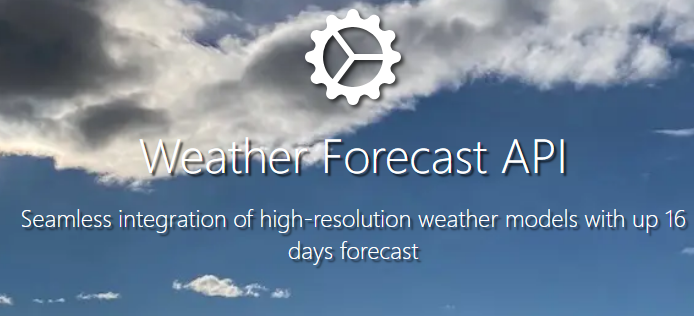
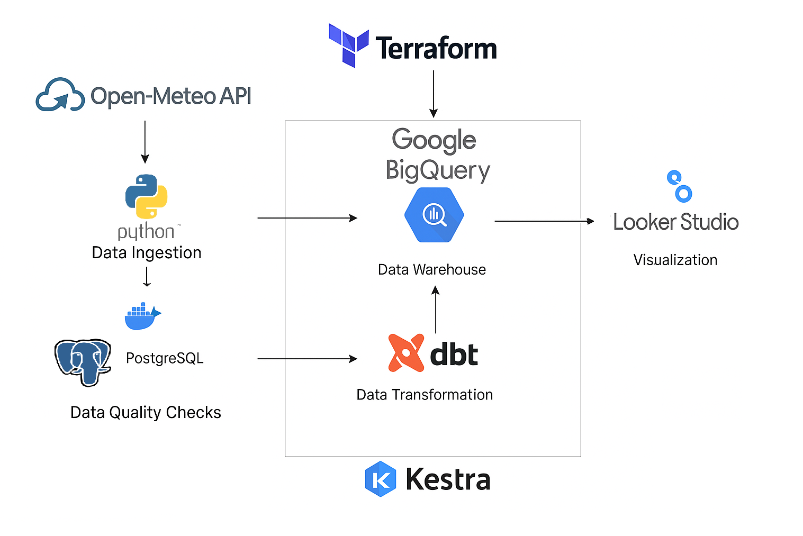
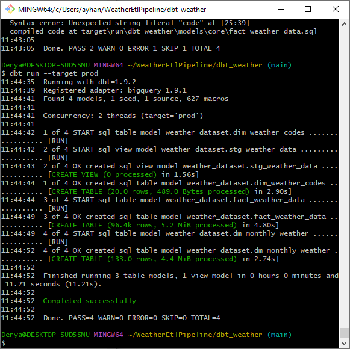
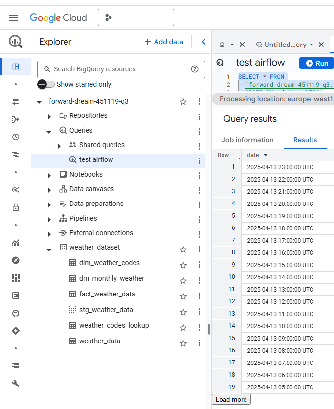
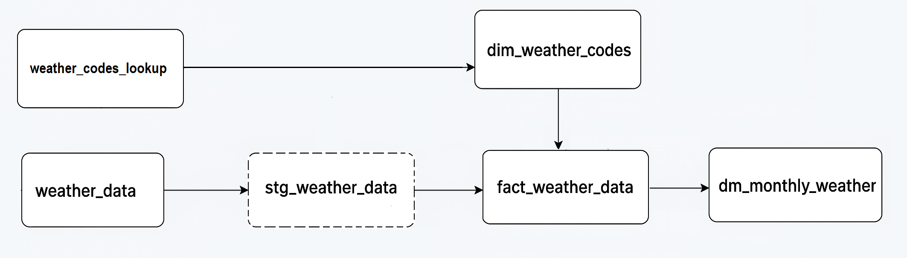
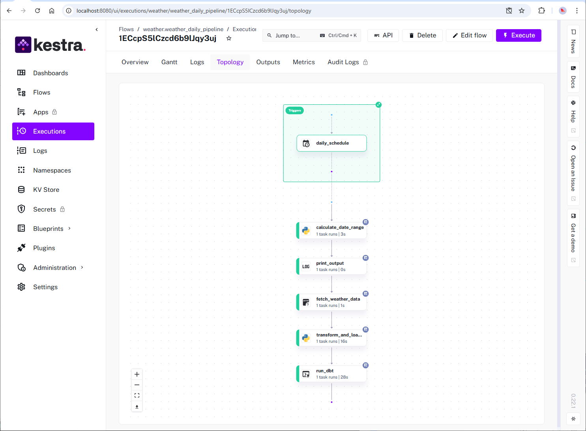
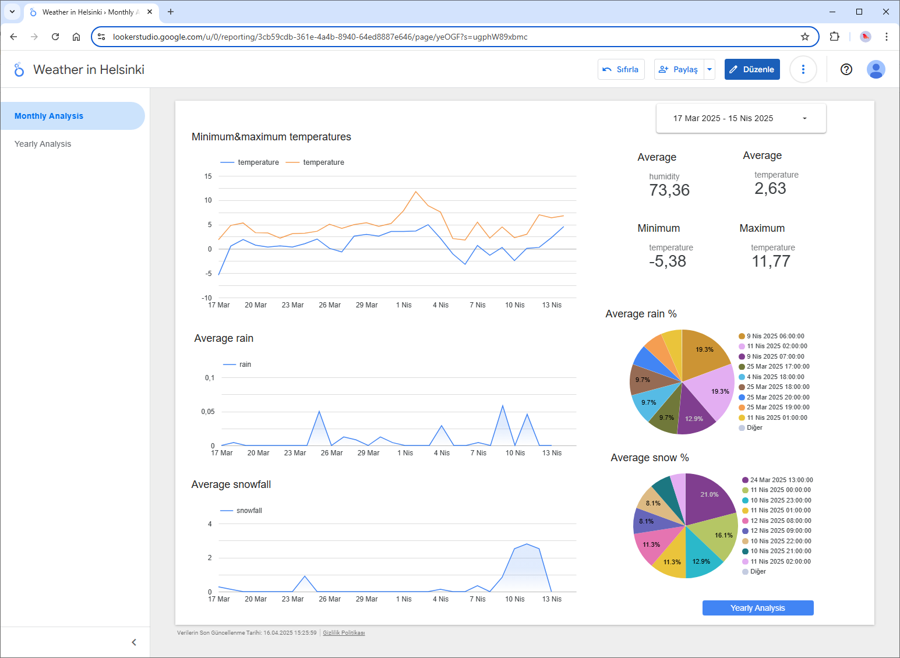
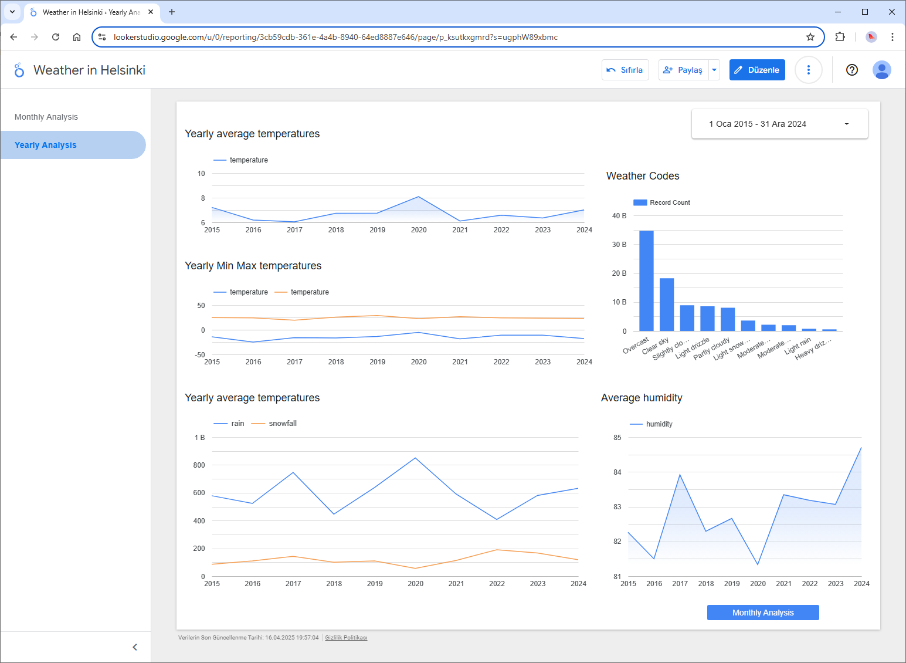

<h1 align="center">
    <strong>Data Engineering Zoomcamp Project: Helsinki Weather Analysis</strong>
</h1>

<p align="center">
<a href="https://open-meteo.com/">Open Meteo</a> •
<a href="https://open-meteo.com/en/docs">API Docs</a> 
</p>
<p align="center">
  
</p>


## 1. Project Overview
Understanding the long-term and hourly weather patterns is essential for urban planning, sustainability efforts, and climate-aware decision-making in northern cities like Helsinki. The city’s unique location and seasonal variability present challenges in identifying stable trends and anomalies. This project leverages the Open-Meteo API to collect hourly historical weather data for Helsinki over a 10-year period. The goal is to analyze temperature fluctuations, humidity levels, wind patterns, and other key metrics across different timeframes — hourly, daily, seasonal, and yearly — to uncover meaningful trends, detect anomalies, and support climate-focused insights. By doing so, the project aims to contribute to data-driven environmental analysis and support future forecasting and resilience strategies for urban living in cold climates.

## 2. Data Source
This project utilizes open historical weather data provided by the Open-Meteo API, a free weather data platform offering global hourly and daily forecasts and climate records. For the purposes of this analysis, the Archive API is used to retrieve hourly weather data for Helsinki across a 10-year time span.

The API provides a wide range of weather parameters with flexible date ranges, enabling time series analysis of local climate conditions. Data is retrieved in batch mode via a RESTful API endpoint with latitude and longitude coordinates corresponding to Helsinki (60.1695° N, 24.9354° E), and timestamps adjusted to the Europe/Helsinki timezone.

Example API endpoint:
https://archive-api.open-meteo.com/v1/archive?start_date=YYYY-MM-DD&end_date=YYYY-MM-DD&latitude=60.1695&longitude=24.9354&hourly=...&timezone=Europe/Helsinki

Main weather parameters used in this project:

| Parameter                 | Description                              |
|---------------------------|------------------------------------------|
| temperature_2m           | Hourly air temperature at 2 meters       |
| rain                     | Hourly rain amount                       |
| snowfall                 | Hourly snowfall                          |
| precipitation            | Hourly total precipitation               |
| relative_humidity_2m     | Hourly relative humidity at 2 meters     |
| soil_temperature_0_to_7cm| Soil temperature from 0 to 7 cm depth    |
| cloudcover               | Cloud cover in percentage                |
| wind_speed_10m           | Wind speed at 10 meters                  |
| wind_direction_10m       | Wind direction at 10 meters              |
| weather_code             | Encoded weather condition classification |
| pressure_msl             | Mean sea level pressure                  |

The data retrieved enables in-depth temporal analysis of Helsinki's climate, supporting hourly, daily, and seasonal trend exploration.


### 3. Data Architecture

<p align="center">
  
</p>

The overall data pipeline is designed to fetch, process, store, and visualize 10 years of hourly weather data for Helsinki using modern open-source tools and cloud services. The architecture leverages Docker containers, PostgreSQL for raw data storage, dbt for data transformation, BigQuery for scalable querying, and Looker Studio for visualization. Workflow orchestration is handled via Kestra, scheduled to run daily at midnight.

### **3.1 Data Ingestion**
A custom Python script weather_ingest.py is built to fetch historical weather data from the Open-Meteo API and load it into a PostgreSQL database running in a Docker container as a development side. The ingestion command is parameterized and executed as follows:

```bash
docker run --network=pg-network weather_ingest:v001 \
  --start_date="2015-01-01" \
  --end_date="2025-04-06" \
  --user="root" \
  --password="root" \
  --host="pg-database-new" \
  --port="5432" \
  --db="weather_dataset" \
  --table_name="weather_data" \
  --api_url="https://archive-api.open-meteo.com/v1/archive"
```

### **3.2 Data Quality Checks in PostgreSQL**
Basic validation is conducted to ensure the integrity of ingested data:

- Missing Data Check:
```sql
SELECT 
    COUNT(*) AS total_records,
    COUNT(temperature_2m) AS valid_temperature,
    COUNT(rain) AS valid_rain,
    COUNT(snowfall) AS valid_snowfall
FROM "weather_data";
```
- Outlier Detection:
```sql
SELECT temperature_2m 
FROM "weather_data"
ORDER BY temperature_2m DESC
LIMIT 10;
.... MIN - MAX etc.
```

- Cleaning Outliers:
```sql
DELETE FROM "weather_data"
WHERE temperature_2m > 50 OR temperature_2m < -50;
```
### **3.3  Infrastructure as Code with Terraform**
Using Terraform for creating GCP infrastructure is easy to handle. 
By creating main.tf and variables.tf files you can create your Infrastructure
The files include the generation of a BigQuery Dataset
To automate the setup of the cloud infrastructure, I used Terraform as an Infrastructure as Code (IaC) tool.
The setup includes:
- A BigQuery dataset to store processed tables and enable further analytics.
- main.tf: Contains the definitions of resources for the dataset.
- variables.tf: Stores configurable inputs such as project ID, dataset name, and region.

### **3.4 Data Transformation with dbt**
Once the weather data is collected and cleaned, we use dbt (data build tool) to further organize and enhance it. dbt helps us manage our data models in a structured, version-controlled way. It allows us to write transformation logic using SQL and then turns that logic into views or tables in our data warehouse.
<p align="center">
  
</p>

Here’s how dbt is used in the project:

#### **Key Transformation Steps**
Data Cleaning: We remove any incomplete or invalid entries — for example, rows without temperature readings are filtered out.

Data Enrichment: We enhance the dataset by linking it with a separate table that explains the weather condition codes (like sun, rain, snow).

Data Aggregation: We summarize the data — such as calculating total rainfall or average temperature per month — to make it more useful for analysis and visualization.

#### **Structure of dbt Models**
Staging Layer (stg_weather_data)
This is where we prepare and clean the raw data. It’s like a first pass to standardize and filter the information.
```sql
  ...
  where temperature_2m is not null 
    and temperature_2m between -50 and 50
    and date>='2015-01-01'
  ...
```

Core Models (fact_weather_data and dim_weather_codes)
These models combine data from the staging layer and lookup tables. They provide a structured and enriched version of the data, ready for use in dashboards or further analytics.

Monthly Summary (dm_monthly_weather)
This model creates a monthly view of key metrics like total rain, total snowfall, and average temperature and humidity. It helps identify trends over time.

Seed Data (weather_codes_lookup.csv)
A small, static reference file is loaded into the data warehouse. It helps explain what each weather code stands for (e.g., 1 = Sunny, 3 = Rainy).

Together, these dbt models help turn raw weather data into clean, meaningful, and analysis-ready information, all while being easy to manage and update over time.

<p align="center">
  
</p>
<p align="center">
  
</p>


#### Profile.yml Configuration
To manage multiple environments in dbt, we separate our development and production configurations using the profiles.yml file. This allows us to easily switch between different platforms for development and production work.

In the profiles.yml file, I define two targets: dev and prod.

##### **Development (dev) Configuration**

Uses PostgreSQL as the data source.

Connects to a local PostgreSQL instance with necessary credentials: user, password, host, port, and database name.
Ensures data is loaded and tested in a safe, controlled environment before deployment.


##### **Production (prod) Configuration**
Uses Google BigQuery for data storage and processing.
Connects via service account authentication: GCP project, dataset name and region name. 
Authentication handled through a secure service account key (my-creds.json).

##### **Why This Matters**
By setting up this structure:
* I maintain a clear separation between development and production.
* Prevent accidental changes in production.
* Allow for smooth transitions when deploying tested and validated changes.


```bash
dbt seed --target dev / prod
dbt build --target dev / prod
#If you just want to test some specific models
dbt build --select core.fact_weather_data --target dev
```


### **3.5 Workflow Orchestration with Kestra**
As part of the overall data pipeline architecture, Kestra was used as the central orchestration engine to automate and schedule the entire ETL process.
<p align="center">
  
</p>
Key Contributions:

- Daily Scheduling: Implemented a cron-based trigger to run the pipeline daily, processing the previous day’s weather data.

- Dynamic Date Calculation: Used Python scripting within Kestra to dynamically calculate start_date and end_date for API queries.

- API Integration: Retrieved historical weather data for Helsinki from the Open-Meteo API with customizable parameters (e.g., temperature, humidity, rain, snow, precipitation).

- Data Transformation & Validation: Parsed and transformed JSON responses using Pandas; handled missing values and ensured schema compatibility.

- BigQuery Ingestion: Loaded the cleaned data into Google BigQuery using google-cloud-bigquery, applying a defined schema and appending records.

- DBT Model Execution: Triggered DBT jobs post-ingestion for data modeling and downstream use in analytics.

- Logging & Error Handling: Integrated detailed logging for observability and implemented error handling mechanisms to manage API or load failures.

Kestra enabled a modular and maintainable orchestration layer, seamlessly integrating scripting, API interaction, and cloud data warehousing in one declarative YAML pipeline.


### **3.6 Data Visualization**
Dashboard Link: https://lookerstudio.google.com/s/ugphW89xbmc
To present the processed weather data in an insightful and interactive format, a dashboard was built using Looker Studio (formerly Google Data Studio).

Dashboard Highlights:

- Date Range Filter: Enables users to select a custom time range for analysis.

- Time Series Charts: Visualize trends in min-max temperature, average rainfall, and snowfall over time.

- Extreme Value Indicators: Display maximum and minimum values for temperature.

- Scorecards: Show average humidity levels for the selected date range.

The dashboard provides a clear and concise overview of historical (monthly and yearly) weather conditions in Helsinki, supporting data-driven insights and easy interpretation.

<p align="center">
  
</p>

<p align="center">
  
</p>


## **4. Project Prerequisites**

- Google Cloud Platform (GCP) account and GCP service account key
- Google Cloud SDK 
- Terraform installed for Infrastructure as Code (IaC) 
- PostgreSQL
- Python 
- Dbt 
- Kestra
- Docker

## **5. Setup Instructions**
### Step1. Copy the project from GitHub
 ``` git clone https://github.com/dryzrlbs/WeatherPipeline.git ```

### Step2. Create GCP accounts and keys

### Step3. Terraform
Create main.tf and variables.tf files. Once these files are configured, the infrastructure is deployed using the following Terraform commands:
 ```
cd WeatherPipeline/terraform
terraform init       # Initializes the working directory
terraform plan       # Shows the execution plan
terraform apply      # Applies the changes and creates the infrastructure
 ```
### Step4. Download batch data for fist time setup
 - Data time intervar 10 years -(today()-2) day data from "Open-Meteo API" 
 ```bash
 python weather_ingest_forbigquery.py     
  --start_date 2015-01-01     
  --end_date {today()-2} 
  --project_id gcpProjectname     
  --dataset_id your_dataset_name     
  --table_name yout_table_name     
  --api_url https://archive-api.open-meteo.com/v1/archive
```
- weather_ingest.py for PostgreSQL dev environment
### Step5. Docker-PostgreSQL configurations for dbt model
  - .dbt/profiles.yml account, key, project name changes
  -  WeatherEtlPipeline/docker-compose.yml mounting volumes, reorganize paths
  - Run your dbt project (--target dev: PostgreSQL  --target prod: BigQuery )
 ```bash
     dbt run --profiles-dir /yourPath/.dbt --log-path /tmp/dbt_logs --target prod 
```
### Step6. Setup Kestra and Ingest Data Daily
  - kestra/docker-compose.yml mounting volumes, reorganize paths
 ```bash
    docker-compose up
    pip install dbt-bigquery
```
  - Execute helsinki-weather.yml on kestra
  - If you get permission error you should give write permission to tmp file on kestra docker
```bash
  
   root@kestra:/app/.dbt# chmod -R 777 /app/temp
```


## **6. Future Works**
- Add dimensional modeling, date grain transformations, and weather code mappings for improved insight generation.
- Investigate temporal trends of specific weather events (e.g., storms, snowfall) to understand their frequency and seasonality.
- Implement more detailed data quality checks to dbt tests
- Expand usage of dbt docs, tags, and model descriptions for better maintainability.
- Expanding dashboards with predictive analytics
- Adding new API fields


